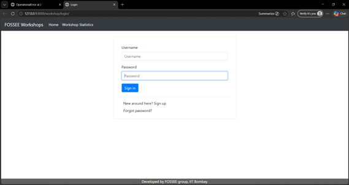
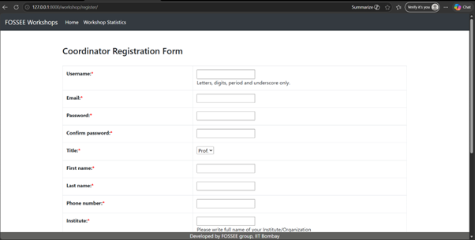
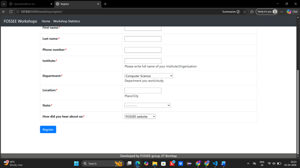
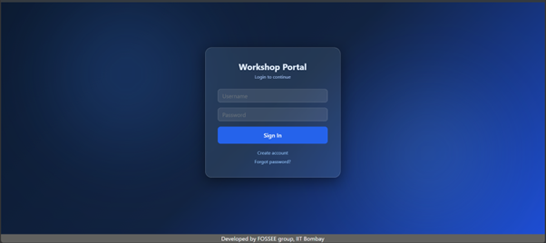
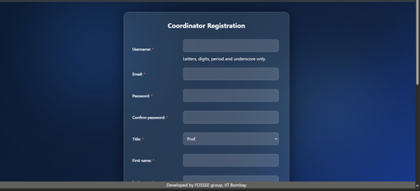
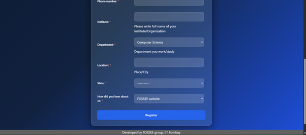

# UI/UX Enhancement Project

## 📌 Overview
This project focuses on improving the user interface and user experience of an existing web application by enhancing layout, responsiveness, usability, and visual consistency.

---

## 🎯 Design Improvements Summary
The improvements were made to create a more modern, responsive, and user-friendly interface while maintaining performance and functionality.

---

## 🧠 Reasoning Behind Improvements

### 1. What design principles guided your improvements?
The following design principles guided the improvements:
- **Simplicity** – Removed unnecessary clutter and focused on clean layouts.
- **Consistency** – Used uniform colors, fonts, and spacing across all pages.
- **Alignment & Spacing** – Proper grid system and spacing for better readability.
- **Visual Hierarchy** – Important elements like headings and buttons were emphasized.
- **User-Centered Design** – Ensured navigation is intuitive and easy to use.

---

### 2. How did you ensure responsiveness across devices?
Responsiveness was achieved using:
- **Bootstrap grid system / Flexbox / CSS Grid**
- Relative units like `%`, `rem`, and `vh/vw`
- Media queries for different screen sizes (mobile, tablet, desktop)
- Flexible images using `max-width: 100%`
- Testing using Chrome DevTools (mobile simulation)

Result: The UI adapts smoothly across all device sizes.

---

### 3. What trade-offs did you make between design and performance?
Some trade-offs were necessary:
- Added CSS animations for better UX → slightly increased load time
- Used high-quality images → improved UI but increased page weight
- More UI components → slightly more rendering complexity
- Chose readability and aesthetics over minimal DOM structure

Overall, performance impact was kept minimal while improving user experience significantly.

---

### 4. What was the most challenging part of the task and how did you approach it?
The most challenging part was:
- Making the layout consistent across multiple pages with different structures

How it was solved:
- Created reusable components (navbar, cards, forms)
- Standardized CSS classes
- Used a consistent spacing and typography system
- Tested each page individually for alignment issues

This ensured a unified look and feel across the application.

---

## 🖼️ Visual Showcase

### Before Improvements

---

### After Improvements

